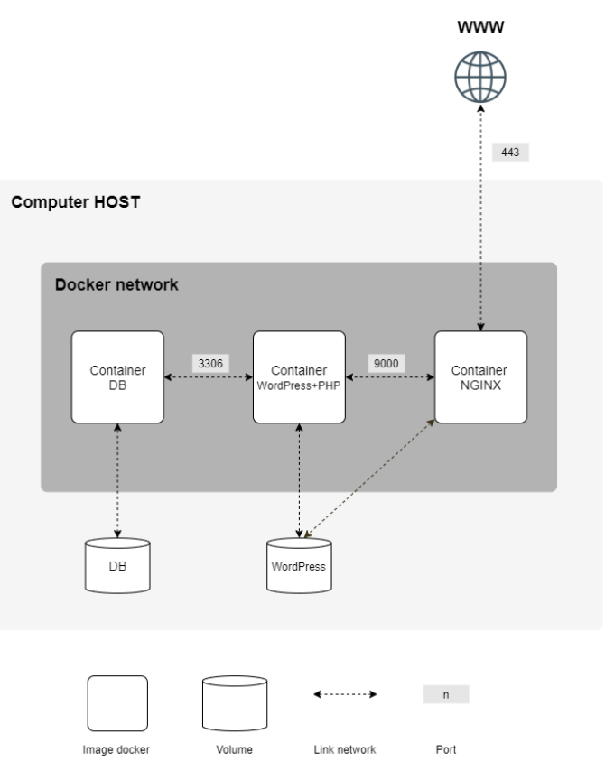

# INCEPTION

> Inception is a 42 project that aims to deepen your knowledge of system administration through Docker containerization. You are required to virtualize several services, each running in its own Docker container, and orchestrated with Docker Compose.

## 🛠️ About the Project

This project sets up a classic web architecture using a __LEMP Stack__, and automates the deployment of a WordPress website using Docker containers. It includes:

- **Nginx**: A web server used as a reverse proxy and the single entrypoint to the infrastructure.
- **MariaDB**: A MySQL-compatible database engine storing the WordPress data.
- **WordPress**: A PHP-based CMS for managing dynamic web content.

Each service is containerized and configured manually from scratch (no pre-built images except Alpine/Debian bases), according to the subject constraints.

### 💡 Expected Architecture Diagram



### ⚠️ Recommendations

- **Using a Virtual Machine** (VM) is necessary to run this project.
- It's recommended to name the VM using our login (`antauber` here) to simplify volume and path management.

***
## 🚧 Prerequisites

To run the project, we need to ensure we have:
- Installed [Docker](https://docs.docker.com/get-started/get-docker/)
- Installed [Docker Compose](https://docs.docker.com/compose/install/)
- Make sure our user has root privileges and be in the docker groupe:
```bash
sudo usermod -aG docker $USER
```
*It's necessary to reboot the session (or log out/log in) to apply the group changes*
- Updated `/etc/hosts` with your domain(s):
```bash
127.0.0.1 antauber.42.fr
127.0.0.1 adminer.antauber.42.fr	# BONUS Adminer
127.0.0.1 gimme.antauber.42.fr		# BONUS Static Page
```
- Created:
  - a `.env` file under `srcs/`
  - a `secrets/` folder with credentials
> ⚠️ For security reasons, **never push `.env` or secrets** to any public repo — they’re only included locally for demonstration. (They are here as examples for this school project.)

***
## 📦 Makefile

The **Makefile** manages the Docker Compose lifecycle:

| Command         | Description                                          |
|----------------|------------------------------------------------------|
| `make all`      | Builds and starts all services (`make build` + `make up`) |
| `make re`       | Rebuilds everything (⚠️ deletes volumes and images!) |
| `make fclean`   | Stops and removes all containers/images/volumes     |
| `make status`   | Shows current status, containers, volumes, and IPs  |
| `make connectivity` | Pings between services to check network connectivity |
| `make monitor`  | Shortcut to launch the ctop tool inside its container |

***
## 🔐 Mandatory Part Overview

After running the`make al` command, we can view our website directly at `http://antauber.42.fr`.

This project uses a self-signed certificate. When we access our website, a warning may appear in the browser. We can then safely click `Accept the risk and continue` in the `Advanced` settings.

### 🚢 Docker

**Docker** is an open source tool for containerization, allowing all parts of an application to be merged into a single package during deployment. This tool allows different developers to work on the same project in the same environment, without dependencies or operating system issues. Docker works in the same way as a virtual machine, but it allows applications to share the same Linux kernel. It has many advantages as Isolation from the main system, or Simplifies deployment management for operations teams.

### 🏗️ Docker Compose

**Docker Compose** is a tool for defining and launching multiple Docker containers with a `.yml` file. It orchestrates the containerization and deployment of software and packages. It allows you to choose which images to use for certain services, define environment variables, and configure server connections.

Here I choose to use a `.env` and also `secrets` files, so that each service only has access to the variables it needs. The only drawback I find is that it is not compatible with `env_file:` option and is a bit verbose because every variable has to be declared in the docker-compose file.

We can also manage health and dependency control features in cases where certain containers can only be launched if another one already exists/is running.

### 🗄️ Nginx

It's a web server, working as a **reverse proxy**, which can:
- Handles all the requests from your browser,
- Serve static files (HTML, CSS, images, etc.) quickly (faster than Apache).
- Manage SSL encryption to secure communication with users (via TLS certificates).

Here, we can test it by entering the docker and checking if the SSL certificate is correct:
```
docker exec -it nginx bash
curl -vk https://antauber.42.fr
```

### 💾 MariaDB

**MariaDB** is a database server that stores all the data for our WordPress site, like posts, user accounts, and settings. MariaDB is MySQL compatible.

We can test it by enter in the container and log to the database.
```
docker exec -it mariadb bash
mysql -u<user> -p<password>
```
This allow us to use SQL to communicate with our database server, and show our databses or access to our wordpress table.
```
SHOW DATABASES;
USE wordpress_db;
SHOW tables;
```

### 🔗 Wordpress

The **WordPress** software that creates our website. It uses PHP to generate pages and talks to the MariaDB database to get the data it needs.
The WordPress installation wizard will run automatically on first access, using the database credentials from our configuration.
We can connect to the admin page using `http://antauber.42.fr/wp-admin` and log in with the credentials defined in our `.env` and `secrets` files.

***
## 💎 Bonus Part

### 👻 Redis Cache

**Redis** is a key-value database that can store MYSQL queries and deliver significant performance gains. It's an equivalent of Memcached.
As soon as a page is loaded on a site, a query is made to the MySQL database. Redis retains the requests, and caching them. If another visitor loads the same page, Redis will serve the request directly.

We can monitor it directly in the wordpress admin page.

### 🌐 FTP Server

**File transfer protocol** enables the exchange of commands and data between a client (computer or software) and a server (FTP host).
It's working here in a passive mode (because we're in a docker environnement), means we need to open port 21 for FTP comand and random ports between (21100-21103) for data transfer.

We can use it with ftp command `ftp localhost 21` and:
```
USER ftp_user
PASS 1234
binary		# Set binary mode instead of ascii mode
[..]		# get or put to download or upload files
quit
```

### 🧮 Adminer

**Adminer** allows you to manage databases with a single php file. Just upload your single php file and point our browser at it.
We can connect to any database on our server with our browser page `http://adminer.antauber.42.fr` and use 

### 📊 Ctop (bonus of our choice)

**Ctop** is a free open source, simple and cross-platform top-like command-line tool for monitoring container metrics in real-time.
It allows you to get an overview of metrics concerning CPU, memory, network, I/O for multiple containers and also supports inspection of a specific container.

We need to enter into the container to use it with the `docker exec -it ctop /usr/local/bin/ctop` command. We can look at them or get logs, stop/pause them as we need.

> Unfortunatly there is no web mode for this tools (because it's only a I/O content). I first try to use [Glances](https://glances.readthedocs.io/en/latest/docker.html) for monitor the containers but I wasn't able to look at only the containers (it was show me the all htop computer).

### 📄 Static Page

A minimal static HTML site served on: `http://gimme.antauber.42.fr`.
**Go listen this amazing single !**

## 🗂️ Architecture Overview
```
.
├── Makefile
├── secrets/
│   ├── ftp_user_password.txt
│   ├── mysql_password.txt
│   ├── mysql_root_password.txt
│   ├── wp_admin_password.txt
│   └── wp_user_password.txt
└── srcs/
    ├── .env
    ├── docker-compose.yml
    └── requirements/
        ├── bonus/
        │   ├── adminer/
        │   ├── ctop/
        │   ├── ftp/
        │   ├── redis/
        │   └── static_page/
        ├── mariadb/
        ├── nginx/
        └── wordpress/
```

## 📚 Sources

- [Introduction to Docker](https://docs.docker.com/get-started/introduction/)
- [About Docker Orchestration](https://www.redhat.com/fr/topics/containers/what-is-container-orchestration)
- [About Docker Networking](https://medium.com/edureka/docker-networking-1a7d65e89013)
- [Nginx Documentation](https://nginx.org/en/)
- [Understand Nginx](https://www.digitalocean.com/community/tutorials/understanding-nginx-server-and-location-block-selection-algorithms)
- [Get into FastCGI (for Nginx)](https://www.digitalocean.com/community/tutorials/understanding-and-implementing-fastcgi-proxying-in-nginx)
- [MySQL Installation](https://www.digitalocean.com/community/tutorials/comment-installer-mysql-sur-ubuntu-18-04-fr)
- [Redis Cache Usage](https://gaelbillon.com/installer-et-configurer-redis-pour-wordpress-en-5-minutes/)
- [Adminer Usage](https://kinsta.com/fr/blog/adminer/)
- [FTP Server Informations](https://www.ovhcloud.com/fr/web-hosting/ftp-host/)
- [Ctop Documentation](https://www.tecmint.com/ctop-monitor-docker-containers/)

**Some Repo that inspired me**
- [vbachele](https://github.com/vbachele/Inception/tree/main?tab=readme-ov-file)
- [llesecure](https://github.com/llescure/42_Inception)
- [TFHD](https://github.com/TFHD/Inception?tab=readme-ov-file)

## Credits
Made by **antauber** `[42 Angouleme - July 25]`